# PowerEdit for Jira

Browser-Erweiterung (Manifest V3, Chrome/Edge), die die Jira-Ticket-Bearbeitung
um Markdown-Support, Formatierungsvorlagen und Code-Bloecke erweitert -
darunter die Umwandlung von aus Azure DevOps kopiertem Markdown in
Jira-Wiki-Markup, direkt im Jira-Ticket. Smart-Link-Parsing ist fuer eine
kommende Version geplant.

Aus `# Titel` wird `h1. Titel`, aus `**fett**` wird `*fett*`, aus einer
Markdown-Tabelle wird eine Jira-Tabelle.

## Was die Erweiterung einbaut

Auf Jira-Seiten kommen fuenf Bedienelemente dazu:

1. **Buttonleiste direkt am Feld** – ueber jedem Beschreibungs- und
   Kommentarfeld:
   * *Automatik ist an / aus* – Schalter fuer die Einfuege-Automatik, mit
     Punkt in Gruen bzw. Grau. Dieselbe Einstellung wie im Popup, im Panel und
     am Symbol; ein Umschalten schlaegt sofort ueberall durch.
   * *Umwandeln* – wandelt den Feldinhalt (oder die Auswahl darin) an Ort und
     Stelle um.
   * *Einfuegen* – holt das Markdown aus der Zwischenablage, konvertiert es
     und fuegt es an der Cursorposition ein.
   * *Code* – oeffnet den Dialog fuer einen Codeblock.
   * *Panel* – stellt vier farbige Panels zur Auswahl und fuegt das gewaehlte
     an der Cursorposition ein.
   * *Vorlagen* – stellt die eigenen, in den Einstellungen angelegten
     Vorlagen zur Auswahl und fuegt die gewaehlte an der Cursorposition ein.
     Ohne eigene Vorlagen ist der Button abgeschaltet.
   * *Editor* – oeffnet das Eingabefeld mit Vorschau.
   * *Schloss* – zeigt an, dass das Feld im Bearbeitungsmodus festgehalten
     wird, und gibt es auf Klick wieder frei. Das Festhalten passiert von
     selbst, laesst sich in den Einstellungen aber abschalten.

   Die Beschriftungen sind kurz gehalten, damit die Leiste in eine Zeile
   passt; was ein Button genau tut, steht in seinem Tooltip.
2. **Eingabefeld mit Vorschau** (schwebender `MD`-Button unten rechts) –
   links Markdown einfuegen, rechts das fertige Jira-Markup sehen, dann
   *Ins Ticket einfuegen*, *Feld ersetzen*, *Markup kopieren* oder
   *Formatiert kopieren* (fuer den Rich-Text-Editor). Ueber
   *Feld waehlen* laesst sich das Zielfeld per Klick bestimmen; *Code
   einfuegen* und *Panel aus Vorlage* gibt es auch hier.
3. **Dialog "Code einfuegen"** – Sprache aus der Liste der von Jira
   unterstuetzten Sprachen waehlen, Code eintippen, fertigen Codeblock an der
   Cursorposition einsetzen. Zu erreichen ueber die Buttonleiste am Feld und
   ueber das Panel.

   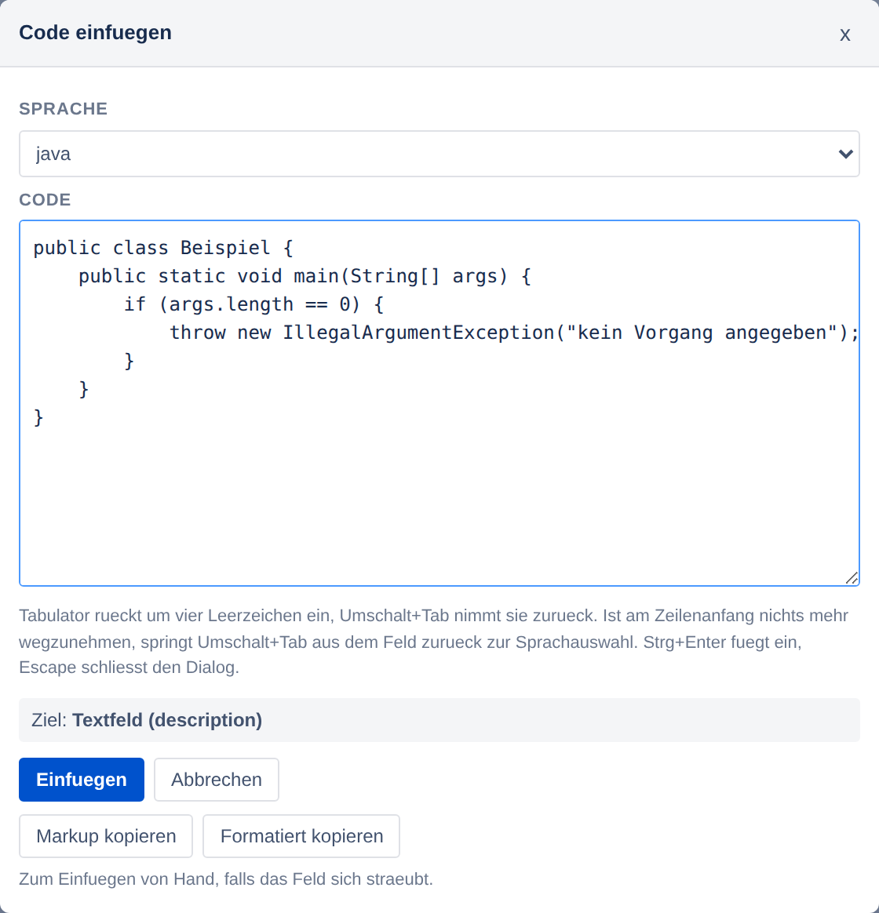

4. **Menue "Panel aus Vorlage"** – vier farbige Vorlagen zur Auswahl: Info
   (blau), Hinweis (gelb), Warnung (rot) und Standard (grau). Die gewaehlte
   wird mit Titel und Platzhaltertext an der Cursorposition eingesetzt, der
   Platzhalter ist danach markiert. Zu erreichen ueber die Buttonleiste am
   Feld und ueber das Panel.

   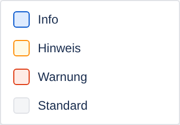

5. **Automatik beim Einfuegen** – wird mit `Strg+V` Text in ein Jira-Feld
   eingefuegt, der nach Markdown aussieht, wandelt die Erweiterung ihn direkt
   beim Einfuegen um. `Strg+Z` macht das rueckgaengig.

Eingefuegt wird immer an der Cursorposition im Jira-Feld, auch wenn der Text
vorher im Panel getippt wurde. Ist im Feld ein Rich-Text-Editor aktiv, kommt
der Text formatiert an; auf Wunsch schaltet die Erweiterung stattdessen vorher
auf den Markup-Modus um.

Klappt das Einfuegen in ein Feld einmal nicht, kopieren *Markup kopieren*
und *Formatiert kopieren* - im Panel wie im Code-Dialog - das Ergebnis zum
Einfuegen von Hand: einmal als Jira-Markup, einmal als `text/html` mit dem
Markup als Rueckfalltext daneben.

Dazu kommen ein Symbolleisten-Popup (Konverter ohne Jira-Seite), ein
Kontextmenue-Eintrag und das Tastenkuerzel `Strg+Umschalt+M`
(macOS: `Cmd+Umschalt+M`), das die aktuelle Auswahl im Editor umwandelt.

## Code einfuegen

Der Knopf *Code einfuegen* – in der Buttonleiste am Feld wie im Panel – oeffnet
einen kleinen Dialog: oben die Auswahlliste mit den Sprachen, die Jira im
`{code}`-Makro kennt, darunter ein mehrzeiliges Feld fuer den Code. *Einfuegen*
schreibt den fertigen Codeblock an die gemerkte Cursorposition im Jira-Feld -
dieselbe Position wie beim Panel, eine markierte Passage wird ersetzt.

Wenn das Zielfeld sich nicht beschreiben laesst, helfen die beiden Knoepfe
darunter: *Markup kopieren* legt `{code:sprache} … {code}` in die
Zwischenablage, *Formatiert kopieren* den Codeblock als `text/html` (mit dem
Markup als Rueckfalltext daneben) - beim Einfuegen von Hand kommt er im
Rich-Text-Editor also als echter Codeblock an. Der Dialog bleibt dabei offen.

Dieselben beiden Knoepfe sitzen im Panel, dort fuer das umgewandelte Markdown:

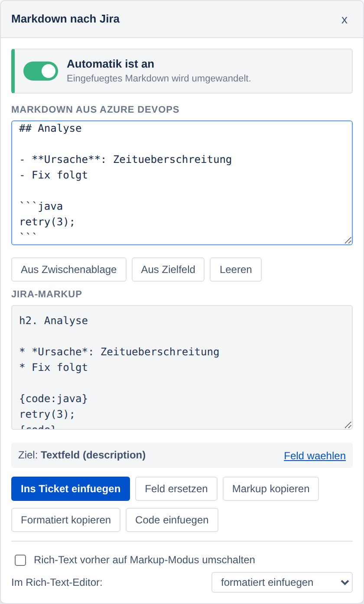

Der Code wird dabei nie durch den Markdown-Parser geschickt: `# Titel` oder
`**fett**` bleiben im Codeblock genau so stehen, wie sie eingetippt wurden.

| Feldtyp | Was ankommt |
| --- | --- |
| Textfeld (Wiki Style Renderer) | `{code:java} … {code}` |
| Rich-Text-Editor | `<pre><code class="language-java"> … </code></pre>` |

Derselbe Codeblock, einmal im Textfeld von Jira Server 9.12 und einmal im
Rich-Text-Editor – eingesetzt an der Stelle, an der der Cursor stand:

| Textfeld (Wiki Style Renderer) | Rich-Text-Editor |
| --- | --- |
| 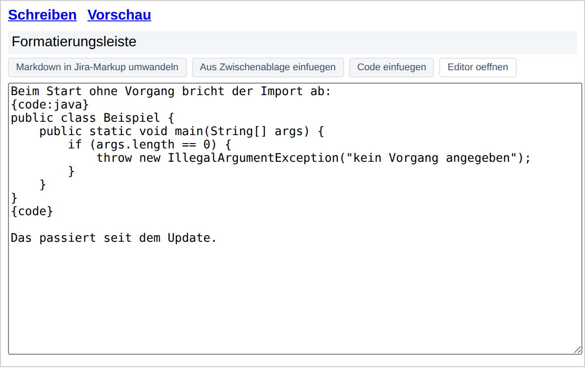 | 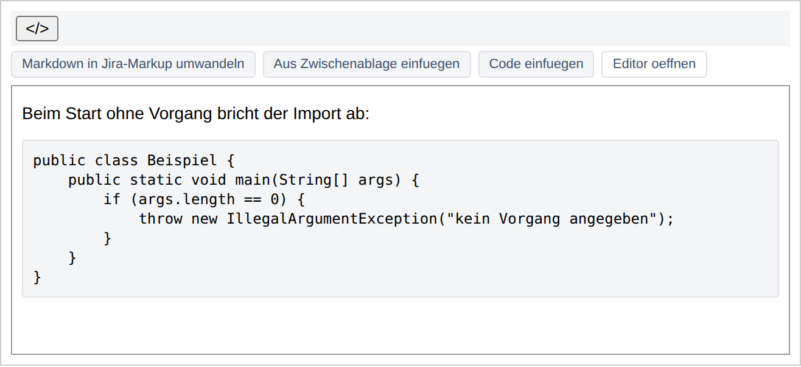 |

Im Rich-Text-Editor gelten dieselben Einstellungen wie beim uebrigen
Einfuegen: ist *Vorher auf den Markup-Modus umschalten* aktiv, wird
umgeschaltet und Jira-Markup geschrieben; steht *Im Rich-Text-Editor* auf
*Jira-Markup einfuegen*, kommt ebenfalls Markup an.

Im Eingabefeld:

| Taste | Wirkung |
| --- | --- |
| `Tab` | rueckt um vier Leerzeichen ein (statt den Fokus zu wechseln) |
| `Umschalt+Tab` | nimmt die Einrueckung wieder zurueck |
| `Umschalt+Tab` ohne Einrueckung | springt aus dem Feld zurueck zur Sprachauswahl |
| `Strg+Enter` | fuegt ein |
| `Escape` | schliesst den Dialog |

Damit bleibt das Feld auch ohne Maus verlassbar; derselbe Hinweis steht als
Text unter dem Eingabefeld und ist ueber `aria-describedby` mit ihm verbunden.

## Panel aus Vorlage

Der Button *Panel aus Vorlage* – in der Buttonleiste am Feld und im Panel der
Erweiterung – stellt vier Vorlagen zur Auswahl:

| Vorlage | Farbe | Rahmen | Hintergrund |
| --- | --- | --- | --- |
| Info | blau | `#0052cc` | `#deebff` |
| Hinweis | gelb | `#ff8b00` | `#fffae6` |
| Warnung | rot | `#de350b` | `#ffebe6` |
| Standard | grau | `#dfe1e6` | `#f4f5f7` |

Gewaehlt wird ueber ein kleines Menue, in dem jede Vorlage ihren Farbtupfer
traegt. Eingefuegt wird an der gemerkten Cursorposition; danach ist der
Platzhaltertext markiert, sodass Tippen ihn ersetzt.

Was ankommt, haengt am Feldtyp:

| Feld | Ausgabe |
| --- | --- |
| reines Textfeld | `{panel:title=Info\|borderColor=#0052cc\|bgColor=#deebff} … {panel}` |
| Rich-Text-Editor | dasselbe als HTML: ein `div` mit denselben Farben, Titel fett darueber |

Ist *Vorher auf den Markup-Modus umschalten* eingestellt, wird aus dem
Rich-Text-Editor erst ein Textfeld – dann kommt auch dort Wiki-Markup an.

**Warum `{panel}` und nicht `{info}`/`{note}`/`{warning}`:** Diese drei Makros
stammen aus Confluence. Der Wiki Style Renderer von Jira Server / Data Center
bringt sie in aller Regel nicht mit; sie stuenden dann woertlich im Ticket.
`{panel}` gehoert dagegen zur dokumentierten Textformatierung von Jira und
kennt `title`, `borderColor` und `bgColor` – die Farbe steckt darum in der
Vorlage, nicht im Makronamen. (`borderStyle` und `titleBGColor` sind ebenfalls
dokumentiert, werden hier aber nicht gebraucht.)

Titel, Platzhalter und Farben stehen an einer Stelle – `PANEL_TEMPLATES` in
`src/settings.js`. Die Ausgabe erzeugen `panelMarkup` und `panelHtml` in
`src/converter.js` aus derselben Vorlage, damit Markup- und HTML-Zweig nicht
auseinanderlaufen.

## Eigene Vorlagen

Ueber die Einstellungsseite lassen sich eigene Textbausteine anlegen: Titel,
Markup und bis zu 5 Platzhalter je Vorlage. Ein Platzhalter steht im Markup
als `${Name}`, zum Beispiel:

```
h3. ${Titel}

{panel}${Beschreibung}{panel}
```

In der Buttonleiste am Feld holt der Button *Vorlagen* die eigenen Vorlagen
ins Menue. Hat die gewaehlte Vorlage Platzhalter, oeffnet sich vorher ein
kleiner Dialog mit einem Eingabefeld je Platzhalter (`Strg+Enter` fuegt ein,
`Enter` im letzten Feld ebenso, `Escape` schliesst ohne einzufuegen); ohne
Platzhalter wird sofort eingefuegt. Ein unausgefuellter Platzhalter landet als sein eigener Name im
Ticket, nie als `${...}`. Eingegebene Werte werden gegen das Jira-Markup
gehaertet: `\`, `{`, `}`, `[`, `]` und `|` erscheinen maskiert, damit ein Wert
kein Makro eroeffnet oder eine Tabellenzelle aufbricht.

Zwei Einschraenkungen gehoeren dazu:

* **Vorlagen bleiben auf diesem Geraet.** Anders als die uebrigen
  Einstellungen liegen sie in `chrome.storage.local`, nicht in
  `chrome.storage.sync`, und wandern darum nicht auf andere Geraete mit -
  `chrome.storage.sync` fasst nur 8 KB je Eintrag, das waere schon nach
  wenigen Vorlagen voll.
* **Im Rich-Text-Editor kommt das Markup unformatiert an**, solange nicht auf
  den Markup-Modus umgeschaltet wird - anders als bei formatiert eingefuegtem
  Markdown gibt es zu einer freien Vorlage kein aequivalentes HTML.

## Bearbeitung einfrieren

Das Hauptfeld eines Vorgangs – die Beschreibung – wechselt in Jira per Klick
zwischen Ansicht und Bearbeitung, und ein Klick daneben beendet die
Bearbeitung genauso schnell wieder. Was im Feld stand, ist danach entweder weg
oder liegt ungewollt als Entwurf am Vorgang.

Mit der Erweiterung ist das Feld darum automatisch im Bearbeitungsmodus
fixiert, sobald dieser aufgeht: das Schloss in der Buttonleiste ist von
Anfang an zu, und das Feld bleibt offen, bis gespeichert oder abgebrochen
wird. Fuer Kommentar- und Umgebungsfelder gilt dasselbe.

| Schloss zu (eingefroren) | Schloss offen (Jira wie gewohnt) |
| --- | --- |
| 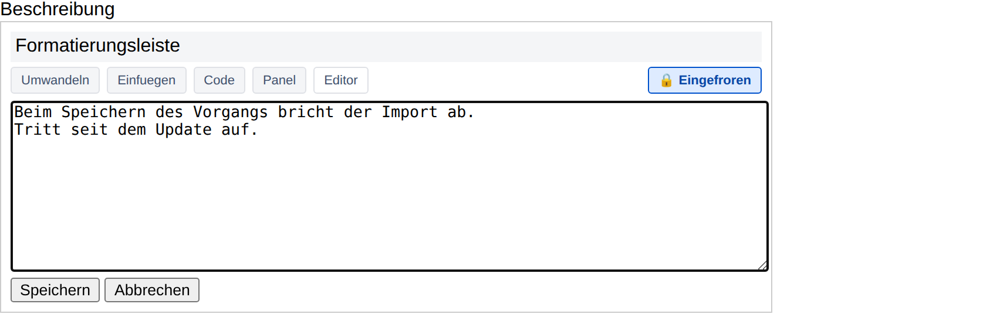 | 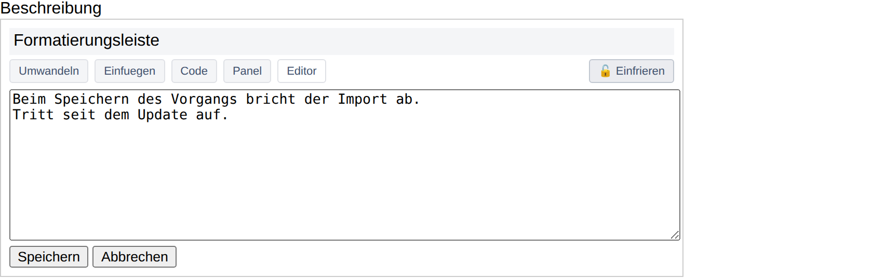 |

Solange das Schloss zu ist:

* Ein Klick neben das Feld schliesst es nicht mehr – und die Seite reagiert
  daneben auch sonst nicht auf Klicks. Genau das ist das Einfrieren: der
  Vorgang bleibt so stehen, wie er ist.
* `Escape` bricht das Bearbeiten nicht ab.
* Wer die Seite verlaesst oder neu laedt, wird vom Browser gefragt, ob er das
  wirklich will.
* *Speichern* und *Abbrechen* funktionieren normal – genau wie die
  Werkzeugleiste und der Umschalter zwischen *Visuell* und *Text*. Zum Feld
  gehoert der ganze Block, den Jira beim Bearbeiten aufbaut, nicht nur das
  Eingabefeld darin. Nach dem Speichern oder Abbrechen gibt das Feld seine
  Sperre von selbst wieder ab.
* Die eigene Buttonleiste, der schwebende Editor und die Dialoge der
  Erweiterung bleiben bedienbar – und Jira bekommt von diesen Klicks nichts
  mit, obwohl sie streng genommen „daneben" liegen.
* Beide Bearbeitungsmodi sind abgedeckt: der Textmodus mit der Textarea
  ebenso wie der Rich-Text-Editor (`jira.rte.enabled`), der in einem eigenen
  Rahmen laeuft. Beim Wechsel zwischen beiden baut Jira den Feldblock neu auf
  – die Sperre geht auf das neue Feld ueber, das Schloss bleibt zu.

Ein Klick auf das Schloss oeffnet es: dann gilt wieder Jiras eigenes
Verhalten, und dieses Feld friert auch nicht von selbst wieder ein. Beim
naechsten Bearbeiten faengt alles von vorn an.

Wer das Fixieren gar nicht will, schaltet den Automatismus in den
Einstellungen unter *Verhalten* ab (*Bearbeitetes Feld automatisch offen
halten*): dann bleibt es ueberall bei Jiras eigenem Verhalten, und das
Schloss verschwindet aus der Buttonleiste.

## Automatik ein- und ausschalten

Die Erkennung greift manchmal auch bei Text, der gar kein Markdown ist – ein
Spiegelstrich am Zeilenanfang genuegt. Deshalb laesst sich die Automatik
ueberall dort abschalten, wo man gerade ist:

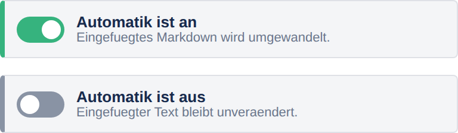

| Wo | Was |
| --- | --- |
| Symbol in der Symbolleiste | Badge zeigt den Zustand: **AN** gruen, **AUS** grau |
| Rechtsklick auf das Symbol | Haken-Eintrag *Beim Einfuegen automatisch umwandeln* |
| Popup (Klick auf das Symbol) | Schalter ganz oben |
| Panel auf der Jira-Seite | derselbe Schalter ganz oben |
| Buttonleiste am Feld | Schalter ganz links: Punkt gruen bzw. grau, daneben *Automatik ist an* / *aus* |
| Schwebender Button | kleiner Punkt: gruen an, grau aus |
| Einstellungsseite | Schalter im Abschnitt *Verhalten* |

Alle Stellen schreiben dieselbe Einstellung; ein Umschalten ist sofort ueberall
sichtbar. Ausgeschaltet bleiben nur die Automatik und nichts sonst – die
Buttonleiste am Feld, das Panel, das Kontextmenue und das Tastenkuerzel
wandeln weiterhin auf Zuruf um.

Der Schalter ist eine echte Checkbox unter der Optik: mit Tabulator erreichbar,
mit Leertaste schaltbar. In der Buttonleiste am Feld ist es ein Knopf, der
seinen Zustand ueber `aria-pressed` meldet – ebenso mit Tabulator erreichbar.
Beschriftung und Farbe wechseln ueberall gemeinsam, der Zustand haengt also
nicht allein an der Farbe.

| Im Popup | Im Panel auf der Jira-Seite |
| --- | --- |
| 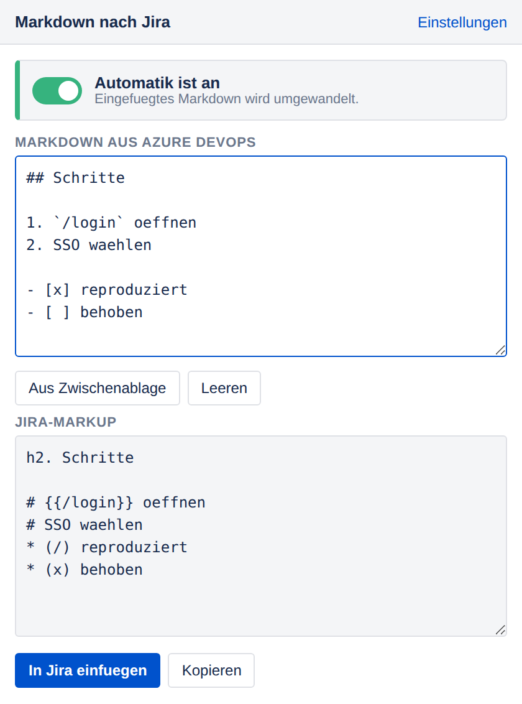 | 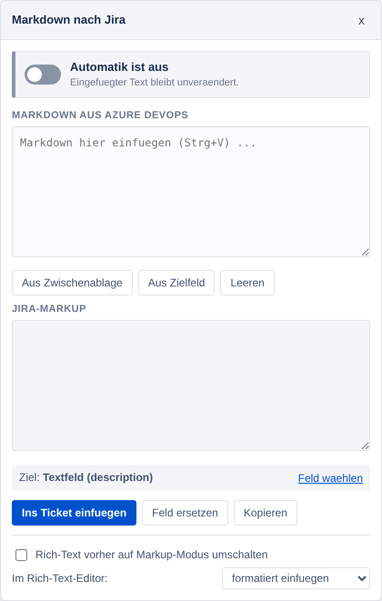 |

Auf der Einstellungsseite sitzt derselbe Schalter im Abschnitt *Verhalten*:

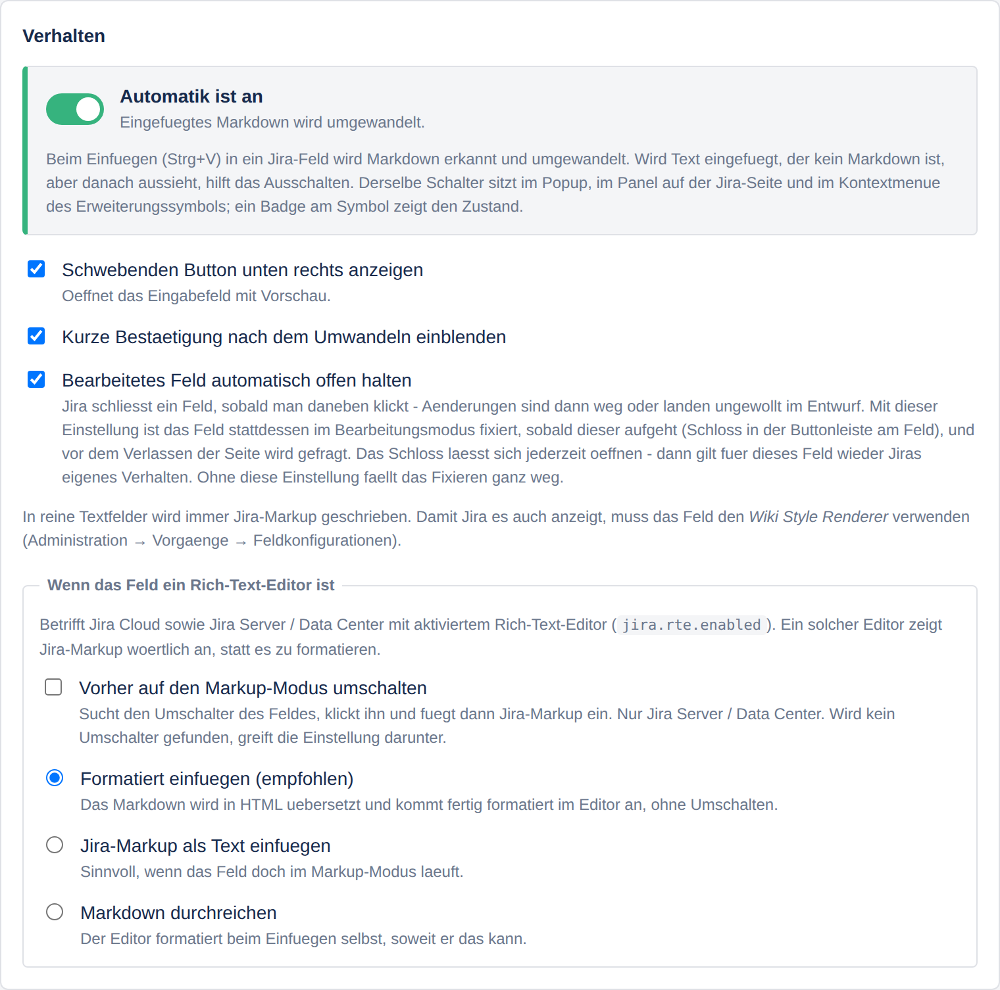

## Installation

Die Veroeffentlichung im Microsoft Edge Add-ons Store ist vorbereitet, aber
noch nicht eingereicht - alle Unterlagen dafuer liegen in
[`docs/store/`](docs/store/). Bis dahin wird die Erweiterung als entpacktes
Paket geladen:

1. [**jira-markdown-converter.zip** herunterladen](https://github.com/pascallink/webkit-ext/releases/latest/download/jira-markdown-converter.zip)
   (immer die neueste, per GitHub Actions gebaute Version) und entpacken.
2. `chrome://extensions` oeffnen (Edge: `edge://extensions`).
3. **Entwicklermodus** einschalten.
4. **Entpackte Erweiterung laden** und den entpackten Ordner
   `jira-markdown-converter` auswaehlen.

Danach laeuft sie auf allen `*.atlassian.net`-Seiten (Jira Cloud).

### Jira Server / Data Center (z. B. 9.12.2)

Selbst gehostete Instanzen muessen einmalig freigegeben werden – sonst passiert
auf der Jira-Seite gar nichts:

* **Einfachster Weg:** die Jira-Seite oeffnen, auf das Symbol der Erweiterung
  klicken und im Popup *Diese Jira-Adresse freigeben* waehlen. Die Seite wird
  danach automatisch neu geladen.
* **Oder** in den Einstellungen unter *Eigene Jira-Adressen* die Adresse
  eintragen (z. B. `jira.firma.de`) und auf *Zugriff erlauben* klicken.

`http` und `https` sind beide abgedeckt, ein Port spielt keine Rolle
(`http://jira:8080/` funktioniert also ebenso wie `https://jira.firma.de/`).

## Umwandlungstabelle

| Markdown (Azure DevOps) | Jira-Markup |
| --- | --- |
| `# H1` … `###### H6` | `h1.` … `h6.` |
| `**fett**`, `__fett__` | `*fett*` |
| `*kursiv*`, `_kursiv_` | `_kursiv_` |
| `***beides***` | `*_beides_*` |
| `~~durchgestrichen~~` | `-durchgestrichen-` |
| `` `code` `` | `{{code}}` |
| ```` ```java … ``` ```` | `{code:java} … {code}` |
| eingerueckter Codeblock | `{noformat} … {noformat}` |
| `[Text](url)` | `[Text\|url]` |
| `` | `!url!` |
| `<https://…>` | `[https://…]` |
| `- a` / `1. a` (auch verschachtelt) | `* a` / `# a`, `**`, `*#` … |
| `- [x] erledigt` / `- [ ] offen` | `* (/) erledigt` / `* (x) offen` |
| Tabelle | `\|\|Kopf\|\|` und `\|Zelle\|` |
| `> Zitat` | `bq.` bzw. `{quote} … {quote}` |
| `> [!NOTE]` … | `{panel:title=Hinweis} … {panel}` |
| `---` | `----` |
| `<br>`, `<b>`, `<i>`, `<code>` | `\\`, `*`, `_`, `{{…}}` |

Sprachnamen werden auf die von Jira unterstuetzten abgebildet (`js` →
`javascript`, `yml` → `yaml`); unbekannte Sprachen fallen auf `{code}` zurueck.
Inhalte von Code-Bloecken bleiben unangetastet, geschweifte Klammern im
Fliesstext werden maskiert, damit Jira sie nicht als Makro liest.

## Jira Server / Data Center im Detail

In Jira 9.x sind Beschreibung, Kommentar und Umgebung normale Textfelder
(`textarea`) innerhalb des Wiki-Feldes mit den Reitern *Schreiben* und
*Vorschau*. Das ist der eindeutige Fall: dort wird immer fertiges Jira-Markup
eingefuegt.

Die Buttonleiste erscheint direkt ueber dem Textfeld, unterhalb der
Formatierungsleiste von Jira. Beim Inline-Bearbeiten baut Jira den Feldblock neu
auf - die Leiste wandert mit und verschwindet zusammen mit dem Feld.

**Wichtig:** Jira zeigt Wiki-Markup nur an, wenn das jeweilige Feld den
*Wiki Style Renderer* benutzt. Steht das Feld auf *Default Text Renderer*,
erscheint `h1. Titel` woertlich im Ticket. Einzustellen unter
Administration -> Vorgaenge -> Feldkonfigurationen -> *Renderer*.

Nach dem Einfuegen loest die Erweiterung `input` und `change` aus, damit Jiras
Entwurfsspeicherung die Aenderung mitbekommt.

## Aktivierter Rich-Text-Editor

Ist in Jira Server / Data Center der Rich-Text-Editor eingeschaltet
(`jira.rte.enabled`), blendet Jira die Textarea aus und legt einen
TinyMCE-Editor darueber. Ein solcher Editor wuerde `h1. Titel` woertlich
anzeigen, statt es als Ueberschrift zu setzen. Dasselbe gilt fuer den Editor
von Jira Cloud. Dafuer gibt es zwei Wege, die sich kombinieren lassen:

### Formatiert einfuegen (Voreinstellung)

Das Markdown wird zusaetzlich nach HTML uebersetzt und als solches eingefuegt.
Der Editor uebernimmt es als echte Formatierung: aus `# Titel` wird eine
Ueberschrift, aus `**fett**` fetter Text, aus einer Markdown-Tabelle eine
Tabelle. Es muss nichts umgeschaltet werden.

Technisch wird ein Einfuege-Vorgang mit `text/html` **und** `text/plain`
ausgeloest. Editoren bevorzugen `text/html`; wo das nicht greift, liegt als
Rueckfallebene weiterhin das Jira-Markup bereit. Geparst wird dabei nur einmal
(`convertBoth`), beide Formate stammen aus demselben Durchlauf.

Aus Sicherheitsgruenden erzeugt der HTML-Zweig nur eine feste Menge an Tags:
alles andere wird maskiert, und Links mit `javascript:` und aehnlichen Zielen
verlieren ihr Ziel. Rohes HTML aus dem Markdown wird nicht durchgereicht.

### Vorher auf den Markup-Modus umschalten

Alternativ (Einstellung *Vorher auf den Markup-Modus umschalten*) sucht die
Erweiterung den Umschalter des Feldes, klickt ihn, wartet bis die Textarea da
ist, und fuegt dann Jira-Markup ein.

Den Umschalter erkennt sie an bekannten Selektoren und andernfalls an der
Beschriftung (*Markup*, *Quelltext*, *Bearbeitungsmodus*, *Visual*, *Source*
...), weil Jira ihn je nach Version anders benennt. Wird keiner gefunden oder
greift der Klick nicht, faellt die Erweiterung auf das formatierte Einfuegen
zurueck - es geht also nichts verloren.

**Einschraenkung:** landet der Text dabei am Anfang des Feldes statt an der
Cursorposition, liegt das am Umschalten selbst - die Schreibflaeche wechselt
vom Editor-Rahmen in die Textarea, und die dort gemerkte Auswahl laesst sich
nicht auf die Textarea uebertragen. Das gilt fuer Panel-Vorlagen genauso wie
fuer eigene Vorlagen.

## Cursorposition

Eingefuegt wird an der Stelle, an der die Schreibmarke zuletzt im Jira-Feld
stand - auch dann, wenn der Text vorher im Panel der Erweiterung getippt wurde.
Sobald man dort hineinklickt, verliert das Jira-Feld die Auswahl; deshalb wird
sie waehrend des Tippens laufend mitgeschrieben (`selectionchange`, `mouseup`,
`keyup`, `focusout`) und vor dem Einfuegen wiederhergestellt. Eine markierte
Passage wird dabei ersetzt.

Blockmakros wie `{code}` und `{panel}` deutet Jira nur am Zeilenanfang. Steht
der Cursor mitten in einer Zeile, ruecken sie darum auf eine eigene Zeile, und
der Text dahinter beginnt ebenfalls neu. Fliesstext wird weiterhin genau an der
Cursorposition eingesetzt.

Im Rich-Text-Editor gilt dasselbe, nur eine Ebene hoeher: dort braucht der
Codeblock einen eigenen Block statt einer eigenen Zeile. Steht die Schreibmarke
mitten in einem Absatz, legt die Erweiterung darum einen leeren Absatz davor
und dahinter. Ohne diesen Trenner zieht der Editor den eingefuegten Block in
den laufenden Absatz hinein - aus dem Codeblock wuerde eine Zeile mit
geschweiften Klammern bzw. Text mit Code-Auszeichnung, aber kein Codeblock.
Steht die Marke schon am Anfang oder am Ende ihres Absatzes, entfaellt der
Trenner auf dieser Seite; im leeren Absatz kommt gar keiner dazu.

Liegt der Fokus noch im Feld, gilt immer die aktuelle Auswahl - die gemerkte
Position kommt nur zum Zug, wenn der Fokus das Feld verlassen hat. Im
Rich-Text-Editor wird der Bereich innerhalb des Editor-Rahmens gemerkt; ist er
durch zwischenzeitliches Umbauen ungueltig geworden, faellt die Erweiterung auf
die aktuelle Position zurueck.

## Einstellungen

Erreichbar ueber das Popup („Einstellungen") oder
`chrome://extensions` → *Details* → *Erweiterungsoptionen*:

* Automatik beim Einfuegen an/aus (derselbe Schalter wie im Popup, im Panel
  und in der Buttonleiste am Feld)
* Schwebenden Button und Bestaetigungen an/aus
* Bearbeitetes Feld automatisch offen halten (das Schloss an der Buttonleiste)
* Verhalten im Rich-Text-Editor: formatiert einfuegen, Jira-Markup als Text
  einfuegen oder Markdown durchreichen; dazu das Umschalten auf den
  Markup-Modus
* Konvertierung: Codesprache uebernehmen, Hinweisbloecke als Panel, einfaches
  HTML uebersetzen, geschweifte Klammern maskieren
* Eigene Jira-Adressen (Jira Server / Data Center)
* Eigene Vorlagen anlegen, bearbeiten und loeschen (Titel, Markup,
  bis zu 5 Platzhalter)
* Ein Probierfeld mit Sofortvorschau

## Berechtigungen

| Berechtigung | Wofuer |
| --- | --- |
| `storage` | Einstellungen speichern, eigene Vorlagen geraetelokal ablegen |
| `contextMenus` | Eintrag im Rechtsklick-Menue |
| `scripting` | Nachladen auf selbst eingetragenen Jira-Adressen |
| `activeTab` | Adresse der aktuellen Seite fuer die Freigabe im Popup |
| `https://*.atlassian.net/*` | Jira Cloud |
| optional: `*://<eigener-host>/*` | Jira Server / Data Center, nur nach ausdruecklicher Freigabe |

Es werden keine Daten an Server gesendet; die Umwandlung passiert vollstaendig
im Browser - festgehalten in der [Datenschutzerklaerung](../PRIVACY.md).

Warum es fuer selbst gehostete Instanzen das breite Muster `*://*/*` unter
`optional_host_permissions` braucht und was es genau bedeutet, steht in
[`docs/store/permissions.md`](docs/store/permissions.md).

## Entwicklung

```
jira-markdown-converter/
├── manifest.json
├── src/
│   ├── converter.js         Markdown -> Jira (ohne DOM, auch in Node nutzbar)
│   ├── editors.js           Jira-Felder finden, lesen, beschreiben
│   ├── codedialog.js        Dialog "Code einfuegen"
│   ├── templatedialog.js  Dialog fuer Platzhalterwerte eigener Vorlagen
│   ├── editlock.js          Bearbeitungsmodus einfrieren (Schloss)
│   ├── content.js           Bedienelemente, Einfuege-Automatik
│   ├── settings.js          gemeinsame Einstellungen
│   ├── background.js        Tastenkuerzel, Kontextmenue, eigene Hosts
│   ├── content.css
│   └── codedialog.css
├── popup/             Konverter in der Symbolleiste
├── options/           Einstellungsseite
├── icons/
└── test/
    └── fixtures/      nachgebaute Jira-Seiten (Cloud, Server 9.x,
                       Server mit Rich-Text-Editor, Inline-Bearbeitung)
```

### Tests

```bash
npm test                  # alle Tests
npm run test:unit         # Konverter, Jira-Markup und HTML (ohne Abhaengigkeiten)
npm run test:settings     # Hosterkennung, Voreinstellungen
npm run test:package      # Manifest und Paketstruktur
npm run test:integration  # echtes Chromium gegen nachgebaute Jira-Seiten
                          # (Cloud-Editor, Jira Server 9.x, Rich-Text-Editor)
npm run lint
```

Der Integrationstest braucht Playwright. Ist es global installiert, hilft
`NODE_PATH=$(npm root -g) npm run test:integration`; fehlt Playwright, wird der
Test uebersprungen statt fehlzuschlagen.

`src/converter.js` ist bewusst frei von DOM-Zugriffen und laesst sich auch
einzeln verwenden:

```js
const { convert, convertToHtml, convertBoth } = require('./src/converter.js');

convert('# Titel\n\n- **a**');
// "h1. Titel\n\n* *a*"

convertToHtml('# Titel\n\n- **a**');
// "<h1>Titel</h1>\n\n<ul><li><strong>a</strong></li></ul>"

convertBoth('# Titel');   // { jira: "h1. Titel", html: "<h1>Titel</h1>" }
```

Beide Formate entstehen aus demselben Parser; die Ausgabe bestimmt ein
Dialekt-Objekt (`JIRA_DIALECT` / `HTML_DIALECT`) in `src/converter.js`. Der
Code-Dialog nimmt genau diese Dialekte direkt (`dialects.jira.codeBlock`,
`dialects.html.codeBlock`) und holt die Sprachliste aus `codeLanguages`, damit
sie nur an einer Stelle gepflegt wird.

## Lizenz

[MIT](../LICENSE).
